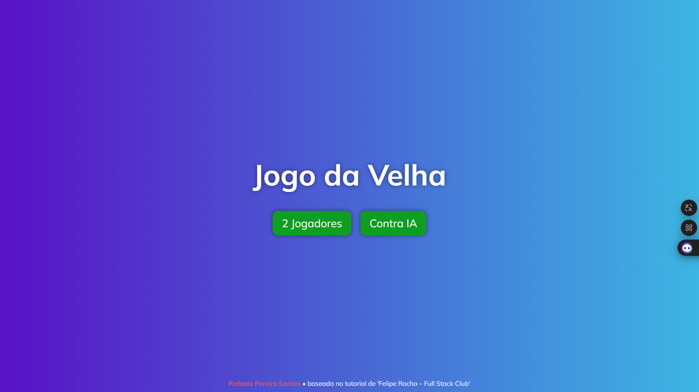
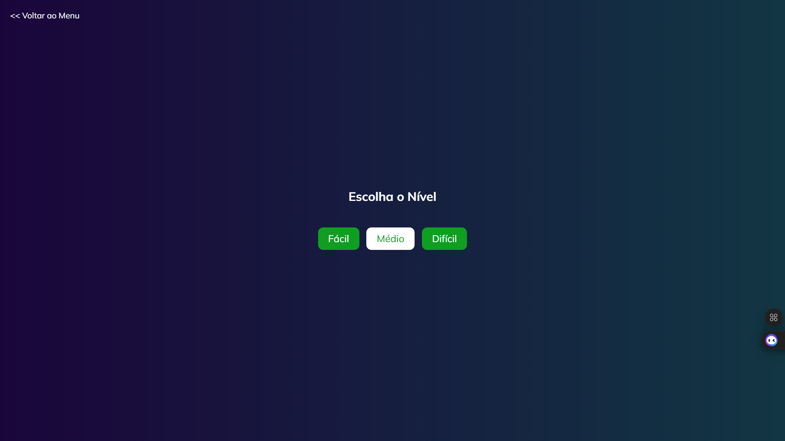
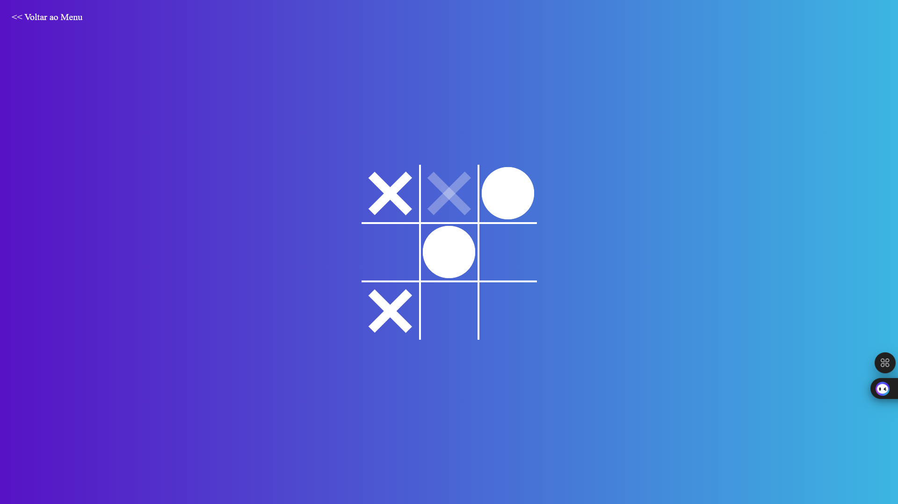

# 🎮 Jogo da Velha


Um **Jogo da Velha** interativo, desenvolvido com **HTML, CSS e JavaScript**, que oferece duas modalidades de jogo: **2 Jogadores** ou **Contra IA** com três níveis de dificuldade.

## 📝 Sobre o Projeto

Este projeto traz uma experiência completa do clássico **Jogo da Velha**:

* Modo **2 Jogadores**: Dois usuários se alternam marcando "X" e "O".
* Modo **Contra IA**: Jogue contra o computador, escolhendo entre **Fácil, Médio ou Difícil**.
* O jogo detecta automaticamente **vitória**, **empate** e permite **reiniciar a partida** ou **trocar de nível**.

O design é moderno, responsivo e com **efeitos visuais para hover**, mensagens de vitória e modal de escolha de nível.

## ⚙️ Tecnologias Utilizadas

* **HTML5** – Estrutura do tabuleiro, modais e menu.
* **CSS3** – Estilização do tabuleiro, efeitos de hover, animações e modal responsivo.
* **JavaScript** – Lógica do jogo, alternância de turnos, IA simples e detecção de vitória/empate.

## 🖥️ Funcionalidades

* 🎮 Escolha entre **2 Jogadores** ou **Contra IA**.
* 🟢 **Detecção de vitória** para X ou O.
* ⚪ **Detecção de empate**.
* 🔄 Reinício do jogo sem recarregar a página.
* 🎚️ Modal para escolha do **nível de dificuldade da IA**.
* ⬅️ Botão **Voltar ao Menu**.
* 💻 Layout responsivo e design moderno com **hover interativo**.
* 🌈 Créditos animados no menu principal.

## 📂 Estrutura do Projeto

```
jogo-da-velha/
│
├─ index.html               # Menu principal com opções de jogo
├─ style.css                # Estilo geral do menu
├─ mulish.ts                # Importação de fontes Mulish
│
├─ version1/                # Modo 2 Jogadores
│  ├─ index.html
│  ├─ style.css
│  └─ script.js
│
├─ version2/                # Modo Contra IA
│  ├─ index.html
│  ├─ style.css
│  └─ script.js
│
├─ images/                  # Imagens do projeto
│  ├─ escolha-nivel.png
│  ├─ jogo-ativo.png
│  └─ escolha-nivel.png
│
└─ README.md                # Documentação do projeto
```

## 🚀 Como Rodar o Projeto

### Opção 1: Abrir direto no navegador

1. Clique duas vezes no arquivo `index.html` na pasta raiz.
2. Escolha entre **2 Jogadores** ou **Contra IA**.
3. O jogo será carregado no seu navegador padrão.

### Opção 2: Servidor local (recomendado)

Se você tiver **Node.js** instalado:

```bash
npx serve
```

* Abra `http://localhost:3000` no navegador.
* Isso garante que a lógica JavaScript funcione corretamente em todos os navegadores.

## Créditos

Desenvolvido por [Rafaela Pereira Santos](https://github.com/devrafaela) • baseado no tutorial de *Felipe Rocha - Full Stack Club*.


## 📸 Preview

### Menu Principal



### Modo Escolha de Nível



### Modo Jogo em Andamento




## 📌 Observações

* Projeto ideal para estudo de **DOM, eventos, lógica de jogo e manipulação de classes** em JavaScript.
* Fácil de expandir com funcionalidades como **placar**, **timer** ou **nível de IA avançado**.
* Design reutiliza **fontes Mulish** e mantém **responsividade** em diferentes tamanhos de tela.
